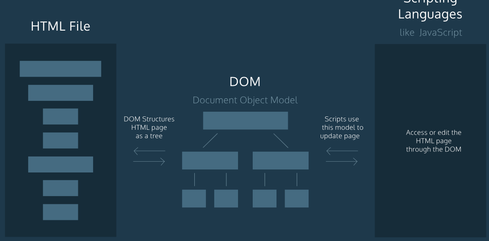
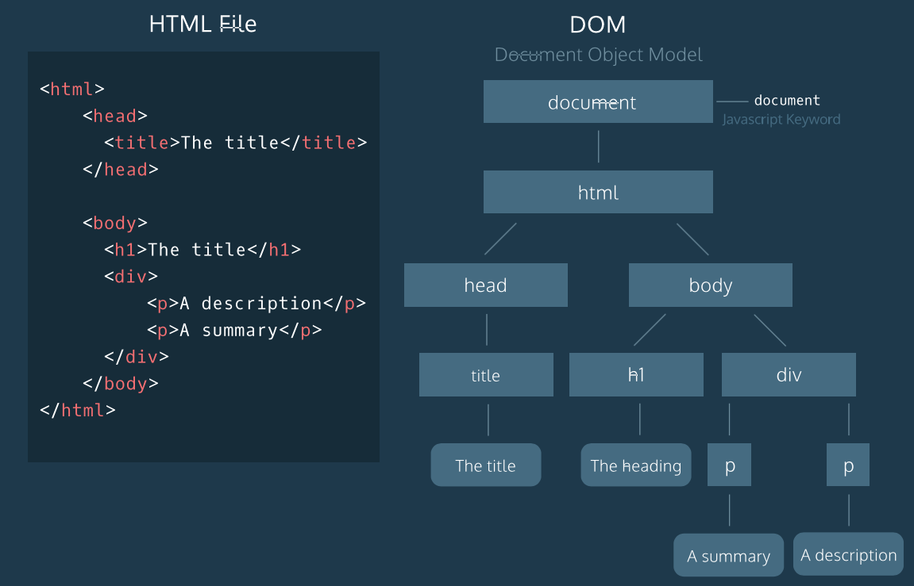
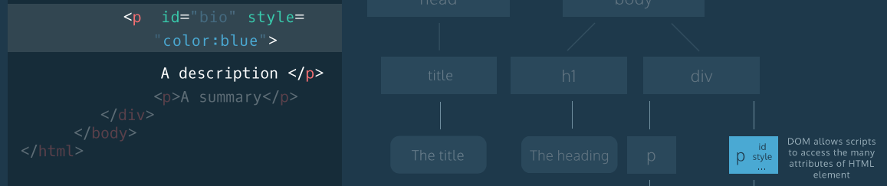
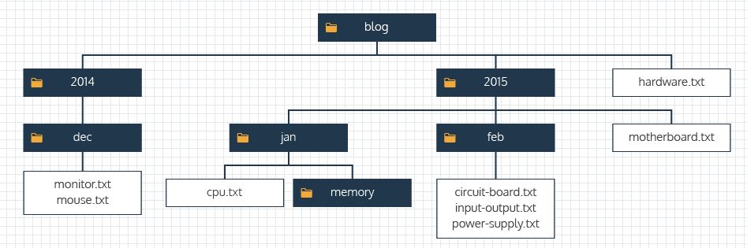
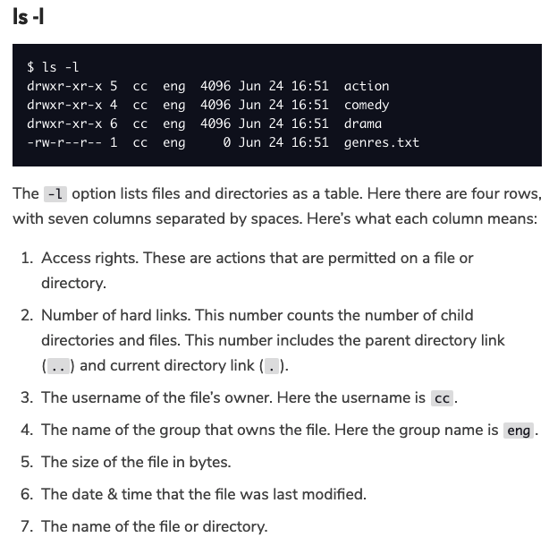
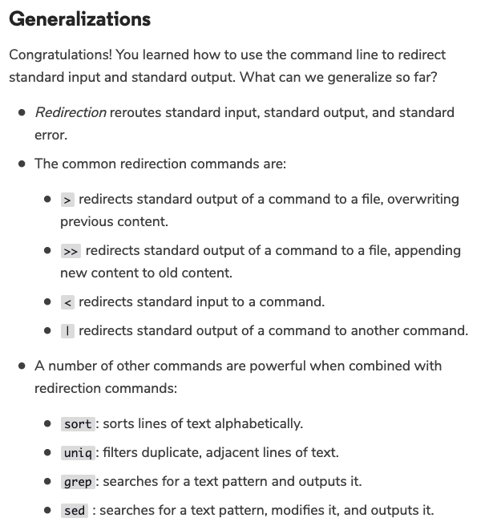
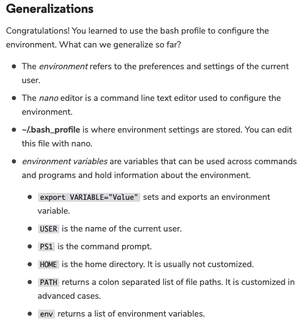
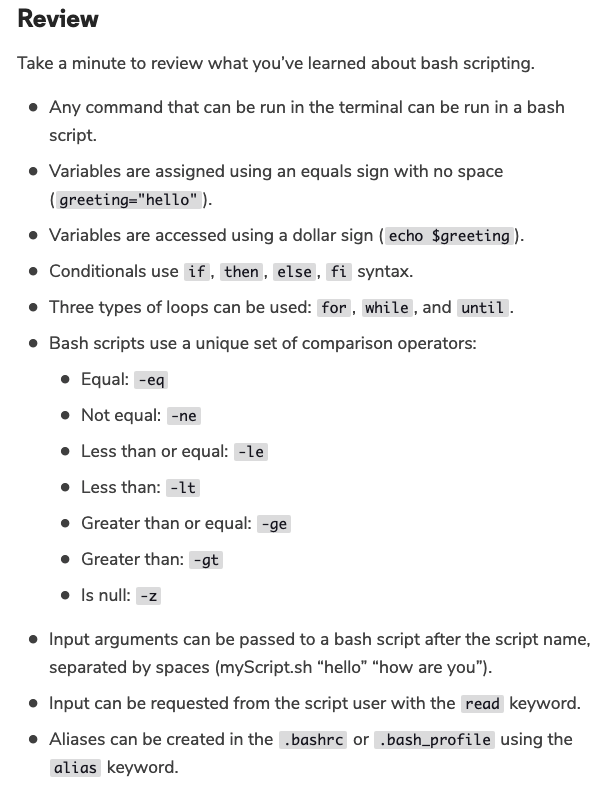
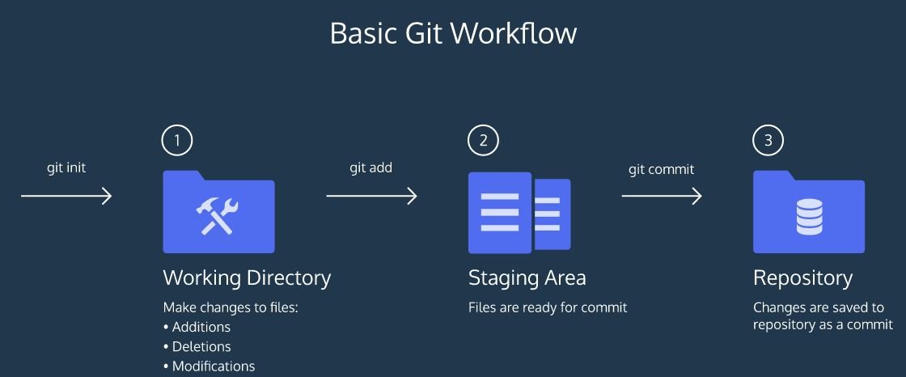

<h2>Frontend Development Note </2>

<h3>How are scripts loaded? </h3>
By default, scripts are loaded and executed as soon as the HTML parser encounters them in the HTML file, the HTML parser waits to load the entire script before from proceeding to parse the rest of the page elements.
Browser parses the HTML elements in their apperance order in HTML file. Same for <code> </code> 
  deliver a template to the browser: <code>  </code> 
<pre>
<code>
// use of HandleBar as template. 
const templateElement = document.getElementById("templateHB");
const templateSource = templateElement.innerHTML;
const template = Handlebars.compile(templateSource);
const compiledHtml = template(context); 
document.getElementById("information").innerHTML = compiledHtml; 
</code>
</pre>

<h3>File system and Command Line </h3>
<b>cat and echo: </b> Cat is for listing content of any files of any kind. Echo is for listing value of some variable. Besides, cho without any value is used to insert a new line in many shell scripts.
<b>Navigation Map</b>

<b>ls -l</b>

<b>Redirection</b>

<b>Environment</b>

<b>Bash Script</b>

<h3>Git Revision </h3>

<h3>BROWSER COMPATIBILITY AND TRANSPILATION </h3>
<b>ES6 and ES5: </b> ES6 is predictably backwards compatible, meaning all ES6 new features can be translated back to ES5 syntax for avioding compatability issues. Look up: <a href="https://caniuse.com/#home"> CanIUse.com </a>
 <b>Transpilation: </b> Transpilation is the process of converting one programming language to another. In here specifically, ES6 -> ES5. 
 <b></b>
