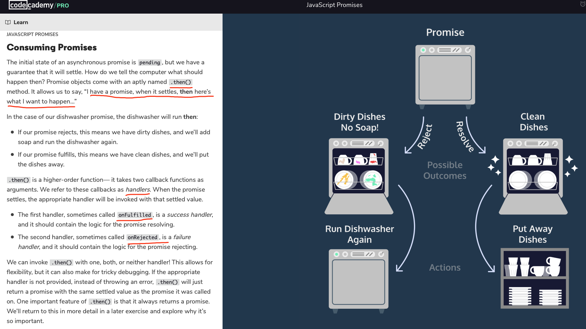

<h2>JS NOTE</h2> 

<h3> Passing by value vs. passing by reference</h3>
In Javascript, The only elements that are not objects are the Primitive Data Types : 
<b>string, number, boolean, null and undefined. </b>Primitive Data Types are passed <i>By Value</i> 
and Objects are passed <i>By Reference</i>. 

<h3> var, const, let</h3>

 <em>var: </em>Prior to ES6 standard, was the only keyword for declaring variables.
  <em>const: </em>a const variable cannot be reassigned because it is constant. 
  <em>let: </em> variable can be reassigned a different value. 
 

<h3> Function as data</h3>

 <b>Two major usages: </b> 1. It enables passing functions as parameter to other functions. -> higher order function (function that either accepts a function as parameter or returns functions as output, or both.)
  <b>Anonymous function invoking: </b>
<pre>
<code>
timeFuncRuntime(() => {
  for (let i = 10; i>0; i--){
    console.log(i);
  }
});
</code>
</pre>
2. There are cases where we write something like function1 = function2 to use the name function1 as a synonym for function2 when the name function1 is for some reason easier to type/remember than function2.

<h3> Iterators</h3>

 <b>.forEach(): </b> in-place modification. 
    <b>.map(): </b> return an array. 
    <b>.filter(): </b> filtering out certain elements from the original array. Boolean callback function return. 
    <b>.findIndex(): </b> returns a single value, either the first in the array that satisfies the condition, or -1 if there' none. 
    <b>.reduce(): </b> Returns a single value after iterating through the array. Essentially, every iteration has the access to the <em>accumulator</em>, which will finally be returned. <a href="https://medium.com/@trekinbami/explanation-of-javascripts-reduce-with-a-real-world-use-case-f3f5014951e2"> example </a>
  <pre>
    <code>
const numbers = [1, 2, 4, 10];
const summedNums = numbers.reduce((accumulator, currentValue) => {
  return accumulator + currentValue
}, 100)  // <- Second argument for .reduce()
console.log(summedNums); // Output: 117
   </code>
   </pre>
      <b>.some(), .every(): </b> Check if there are elements/ all elements that meet the requirement. Returns boolean. 

<h3> Js Objects </h3>

  <b>{}: </b> This is the representatio of object. Array of object can be <code>[{}, {}, {}] </code>. 
   <b>accessing a key' value: </b>  1. dot operator - same as other OOP languages.   2. '[ ]' -> We *must* use bracket notation when accessing keys that have numbers, spaces, or special characters in them. <code> spaceship['Fuel Type'];   // Returns  'Turbo Fuel'</code>
    <b>Const key word: </b> Object cannot be reassigned entirely, but still remain mutable. Use <code>delete objectName.propertyName </code> to delete a property. 
    <b>for...in: </b> Each time the variable is set to objects key.  
  <pre>
  <code>
for (let crewMember in spaceship.crew) {
  console.log(`${crewMember}: ${spaceship.crew[crewMember].name}`)
};
  </code>
  </pre>
  <b>Arrow function and <em>this</em> keyword: </b> Arrow function within objects does not recognise <code>this</code> keyword as referring to the object itself. Should avoid such use. If we must use arrow function, we do it by referring directly to the object name: instead of using <code>this</code>. 
  <pre>
  <code>
const robot = {
  energyLevel: 100,
  checkEnergy: () => {
    console.log(`Energy is currently at ${robot.energyLevel}%.`)
  }
}
  </code>
  </pre>
  <b><em>getter</em> and <em>setter</em> : </b> 1. Perform an action on the data when getting a property & return different values. 
    2. <code>this</code> keyword can be used. Retrieve properties that are private. 
    3. Invoke the method as accessing object's property. <code>object.getter_method </code>
    4. Checking if input/property is valid to use. 
   <b>Deconstructing assignment: </b> Save time from tedious keystrokes. USE A <code>{ }</code>e,g., <code>const residence = vampire.residence;  </code> ===> <code>const { residence } = vampire;  </code>. Also can be used to grad nested properties, such as <code>const { day } = vampire.preferences;  </code>
   <b><em>Object.assign(source, target)</em>: </b> important to know that the method modifies the source object by assigning the content of target object and returns the new object. 
   <b><em>Object.keys(), Object.entries()</em></b>: All property names, all key-value pairs.

<h3> JS Module</h3>

<b><em>Create a module: </em></b> Create an object to represent the module. -> Add properties or methods to the module object. -> Export the module with module.exports. <code>module.exports = Class_name </code>

 <b><em>Node.js vs ES6 </em></b> Node.js: <code>module.exports </code> ES6: <code>export default</code> 

<h3>Promises</h3>

promise 处理一个asynchronise 事件，本身存在三个状态，返回一个状态resolved 或 rejected. .then()作为后续的操作可以同时被定义。
<ul>
  <li>Promises are JavaScript objects that represent the eventual result of an asynchronous operation.</li>
  <li>Promises can be in one of three states: pending, resolved, or rejected.</li>
  <li>A promise is settled if it is either resolved or rejected.</li>
  <li>We construct a promise by using the <code>new</code> keyword and passing an executor function to the <code>Promise</code> constructor method.</li>
  <li><code>setTimeout()</code> is a Node function which delays the execution of a callback function using the event-loop.</li>
  <li>We use <code>.then()</code> with a success handler callback containing the logic for what should happen if a promise resolves. We use <code>.catch()</code> with a failure handler callback containing the logic for what should happen if a promise rejects</li>
  <li>Promise composition enables us to write complex, asynchronous code that’s still readable. We do this by chaining multiple <code>.then()</code>‘s and <code>.catch()</code>‘s.</li>
</ul>

 <b><code>.catch()</code> and <code>.then() with reject</code></b> 在执行resolve的callback 时，如果抛出异常，<code>.catch()</code> 可以避免代码卡死，即运行逻辑进入catch这个方法中。例如下：<code>console.log(somedata)</code> 并不会报错。
<pre>
  <code>
getNumber()
.then(function(data){
    console.log('resolved');
    console.log(data);
    console.log(somedata); //此处的somedata未定义
})
.catch(function(reason){
    console.log('rejected');
    console.log(reason);
});
  </code>
</pre>

<b><code>async ... await: </code></b> Write native JS code into resembling synchronized/imperative code. 

<h3>HTTP and HTTPS</h3>
<b>event loop: </b> JavaScript uses an event loop to handle asynchronous function calls. When a program is run, function calls are made and added to a stack. The functions that make requests that need to wait for servers to respond then get sent to a separate queue. Once the stack has cleared, then the functions in the queue are executed. Web developers use the event loop to create a smoother browsing experience by deciding when to call functions and how to handle asynchronous events. <a href="https://developer.mozilla.org/en-US/docs/Web/JavaScript/EventLoop"> JS Concurrency Model </a> 

<b> XHR(XMLHttpRequest) GET diagram </b>

<b> XHR(XMLHttpRequest) POST diagram </b>

<b> XHR(XMLHttpRequest) fetch GET diagram </b>

<b> XHR(XMLHttpRequest) fetch POST diagram </b>

<b> async GET diagram </b>

<b> async POST diagram </b>

